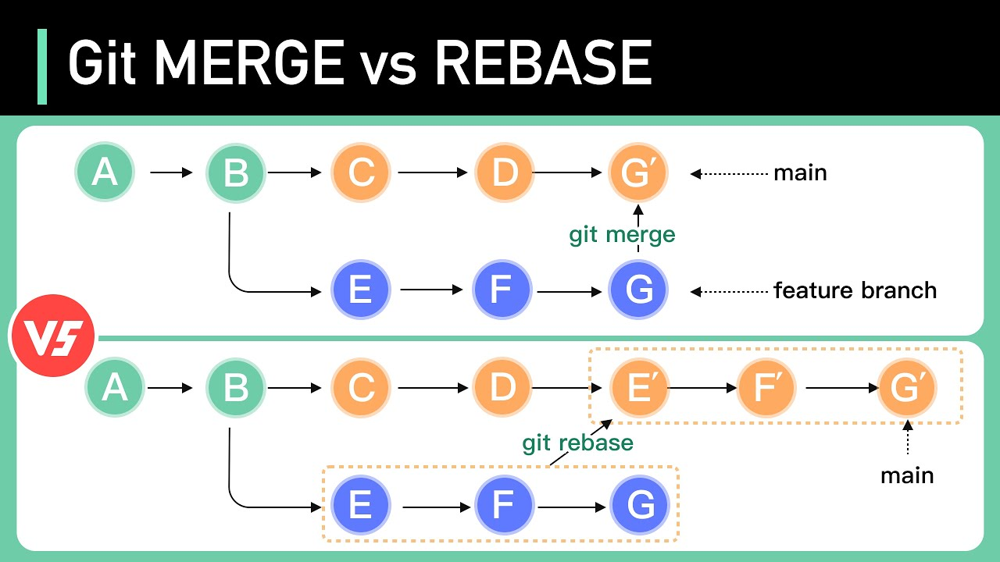

# git-work-flow

## best scenario
1. A person will create a repository on Github
    - with 2 branches: Master & Dev
    - Master is production branch -- never touch this branch
    - To develope new feature, create new branch call feature/:feature-name
2. Leader assigns tasks for his team mates
    - task will be assigned in 'Issues' tab
    - each task will have an id with symbol #
3. Developing new feature
    - developer create new branch from Dev branch
    - remember to commit with symbol # and issue Id to address task is done for specific issue
    - push codes to create pull request 
4. Review code
    - merge feature branch to dev branch after review
5. Realease
    - create a realease branch with version number
    - create a tag with version number
    - merge dev branch to realease branch
6. Push to production
    - merge to Master branch when everything is ready
7. Hotfixes
    - in case bugs in production code, create hotfix branch
    - fix code and commit with issue id
    - merge back to Master or Dev to further fix
    
## Git rebase vs merge
- Merge can be used for small team and small project
- Rebase suits large project with team >2 mates

- Merge preserve log history while Rebase alter it.
    - rebase will organize commits of target branch on top.
- Merge will add extra commit to a branch while rebase dont

## Cherry-pick and git stash
- Cherry-pick allow leader to release a specific task to production
    - instead of merging all commits to master branch, leader can choose what feature should be public today

- Git Stash allow dev to store the WIP without commit to branch.
    - convenient and preserve clean git log

- Git reset --soft :commitId allow dev to delete some unwanted commit but keep the code at current stage
- Use git commit --amend -m "" to re-write just posted commit.